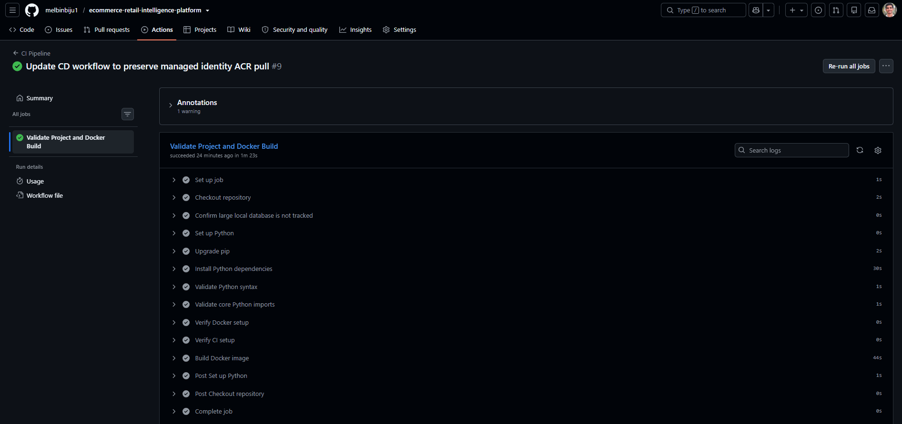
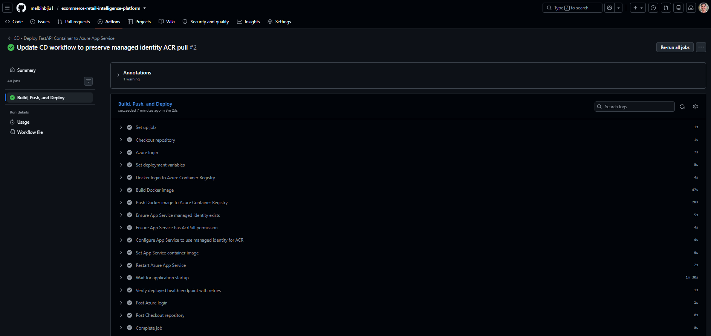

# E-Commerce Retail Intelligence Platform


An end-to-end Data Engineering and AI Business Insights platform built using the Olist Brazilian E-Commerce dataset.

## Project Objective

This project builds a modern e-commerce retail intelligence platform that ingests raw order, customer, product, seller, payment, review, delivery, and geolocation data, transforms it into a warehouse model, produces business KPIs, detects operational anomalies, and provides AI-powered business insights.

## Core Dataset

Main dataset: **Olist Brazilian E-Commerce Public Dataset**

The Olist dataset contains real anonymised e-commerce order data, including:

* Orders
* Customers
* Products
* Sellers
* Payments
* Reviews
* Delivery timestamps
* Geolocation data
* Product category translation

## Key Features

* Batch ETL pipeline
* Raw, staging, warehouse, and KPI data layers
* Data quality validation
* Star schema data warehouse
* Operational metrics layer
* Operational anomaly detection
* Event-driven operational alert pipeline
* Delivery delay anomaly detection
* Seller performance anomaly detection
* Payment anomaly detection
* Freight cost anomaly detection
* Review score anomaly detection
* Cancellation anomaly detection
* Power BI executive dashboard
* FastAPI backend
* JWT authentication
* Role-based access control
* AI business insights assistant
* Docker containerisation
* GitHub Actions CI/CD
* Azure Blob Storage
* Azure SQL Database
* Azure Data Factory
* Azure Key Vault
* Azure Monitor
* Logging, error handling, monitoring, and health checks
* Unit tests, integration tests, and API tests
* Complete documentation, architecture diagram, database diagram, and setup guide

## Business Problem

E-commerce businesses need reliable visibility into sales performance, customer behaviour, seller performance, delivery delays, payment patterns, product demand, customer satisfaction, and operational risks.

This platform helps decision-makers monitor performance, detect unusual business patterns, and receive AI-assisted explanations and recommendations.

## Target Users

* E-commerce Operations Manager
* Sales Manager
* Logistics Manager
* Seller Performance Manager
* Finance Manager
* Executive Leadership
* Data and BI Team

## Portfolio Showcase

A screenshot-backed walkthrough of the completed platform is available here:

```text
docs/project_showcase.md
```

The showcase includes evidence for:

```text
GitHub repository and workflow badges
GitHub Actions CI pipeline
GitHub Actions CD pipeline
FastAPI Swagger UI
Health endpoint response
Executive KPI API response
Operational anomaly API response
AI-ready insights API response
Azure App Service deployment
Azure Container Registry image repository
Azure SQL Database tables
Azure Blob Storage raw landing zone
Azure Data Factory pipeline run
Azure Key Vault secrets
Application Insights availability monitoring
Azure Monitor alert rule
```

## Technology Stack

| Area            | Tools                  |
| --------------- | ---------------------- |
| Programming     | Python                 |
| Data Processing | Pandas, SQL            |
| Local Database  | SQLite                 |
| Cloud Database  | Azure SQL Database     |
| Cloud Storage   | Azure Blob Storage     |
| Orchestration   | Azure Data Factory     |
| API             | FastAPI                |
| Authentication  | JWT                    |
| BI              | Power BI               |
| AI              | OpenAI / Azure OpenAI  |
| DevOps          | Docker, GitHub Actions |
| Monitoring      | Logging, Azure Monitor |
| Secrets         | Azure Key Vault        |
| Testing         | pytest                 |

## Data Architecture

```text
Olist CSV Files
      ↓
Raw Data Layer
      ↓
Raw Data Quality Checks
      ↓
Staging Layer
      ↓
Warehouse Star Schema
      ↓
KPI Views
      ↓
Operational Metrics and Anomaly Detection
      ↓
Power BI Dashboard / FastAPI / AI Assistant
```

## Final Technical Architecture

This project is an end-to-end cloud data engineering and analytics engineering platform for e-commerce retail intelligence.

The final implemented architecture includes:

```text
Olist Raw CSV Data
        ↓
Python Ingestion and Data Quality Validation
        ↓
SQLite Local Development Warehouse
        ↓
dbt Transformations, Tests, and Documentation
        ↓
Operational KPI and Anomaly Detection Layer
        ↓
Azure Blob Storage
        ↓
Azure Data Factory
        ↓
Azure SQL Database
        ↓
FastAPI Backend with Authentication and RBAC
        ↓
Docker + Azure Container Registry
        ↓
Azure App Service
        ↓
Azure Key Vault
        ↓
Application Insights Monitoring
```

### Core Technical Layers

| Layer | Technologies | Purpose |
|---|---|---|
| Data ingestion | Python, pandas, SQLite | Load raw e-commerce CSV data |
| Data quality | Python, SQL | Validate source and transformed data |
| Transformations | SQL, dbt | Build staging models, warehouse models, tests, and documentation |
| Warehouse | SQLite, Azure SQL | Store curated facts, dimensions, KPIs, and operational outputs |
| Operational intelligence | SQL, Python | Generate anomaly alerts and operational risk metrics |
| API backend | FastAPI | Expose business metrics and insights through JSON endpoints |
| Security | API keys, RBAC, Azure Key Vault | Protect API access and cloud secrets |
| Deployment | Docker, ACR, Azure App Service | Deploy the API as a cloud-hosted container |
| Monitoring | App Service Logs, Application Insights | Monitor API logs, health, and availability |

### Final Technical Documentation

| Document | Purpose |
|---|---|
| `docs/final_architecture.md` | Final end-to-end architecture summary |
| `docs/technical_architecture.md` | Detailed technical design decisions, runtime modes, trade-offs, security, deployment, and monitoring |
| `docs/system_flow.md` | Step-by-step flow of data, API requests, deployment, secrets, and monitoring |
| `docs/architecture.md` | Detailed working architecture notes from the full project build |

Recommended reading order:

```text
1. docs/final_architecture.md
2. docs/system_flow.md
3. docs/technical_architecture.md
4. docs/architecture.md
```

## Documentation Index

| Document | Purpose |
|---|---|
| `docs/project_showcase.md` | Screenshot-backed portfolio walkthrough of the completed project |
| `docs/final_architecture.md` | Final implemented architecture summary |
| `docs/technical_architecture.md` | Technical architecture, design choices, and runtime details |
| `docs/system_flow.md` | End-to-end system, data, API, deployment, and monitoring flow |
| `docs/setup_guide.md` | Local, Docker, Azure, and CI/CD setup instructions |
| `docs/data_dictionary.md` | Tables, views, files, scripts, reports, and API artifacts |
| `docs/data_governance.md` | Data quality, security, access, deployment, and monitoring governance |
| `docs/data_lineage.md` | Source-to-serving data lineage |
| `docs/azure_blob_storage.md` | Azure Blob Storage raw data landing zone |
| `docs/azure_sql_database.md` | Azure SQL migration and serving database setup |
| `docs/azure_data_factory.md` | Azure Data Factory orchestration setup |
| `docs/azure_app_deployment.md` | Azure App Service container deployment |
| `docs/azure_key_vault.md` | Azure Key Vault secret management |
| `docs/azure_monitoring.md` | Application Insights availability monitoring and alerts |
| `docs/azure_ci_cd.md` | GitHub Actions CI/CD deployment automation |
| `docs/cost_optimisation.md` | Cost-conscious Azure resource decisions |
| `docs/project_scope.md` | Project scope, boundaries, and implementation choices |
| `docs/azure_sql_migration_plan.md` | Azure SQL migration planning notes |

## Project Layers

### Raw Layer

Stores the original Olist source data with minimal changes.

### Staging Layer

Cleans and standardises raw data, including date conversion, text standardisation, product category translation, and delivery flags.

### Warehouse Layer

Creates business-ready dimension and fact tables using a star schema.

### KPI Layer

Creates trusted SQL views for Power BI, FastAPI, and the AI assistant.

### Operational Anomaly Layer

Detects unusual operational patterns such as revenue drops, delivery delay spikes, seller performance issues, payment anomalies, freight cost anomalies, low review patterns, and cancellation spikes.

### AI Business Insights Layer

Uses trusted KPI and anomaly outputs to generate business explanations and recommendations.

## Current Local Development Flow

```text
CSV Files
   ↓
Python Ingestion Scripts
   ↓
SQLite Raw Tables
   ↓
Data Quality Checks
   ↓
Staging SQL Transformations
   ↓
Warehouse Tables
   ↓
KPI Views
   ↓
Operational Anomaly Detection
```

## Planned Cloud Architecture

```text
Azure Blob Storage
      ↓
Azure Data Factory
      ↓
Azure SQL Database
      ↓
Warehouse Tables + KPI Views
      ↓
Power BI + FastAPI
      ↓
AI Business Insights Assistant
      ↓
Azure Key Vault + Azure Monitor
```

## Portfolio Value

This project demonstrates practical skills in:

* Data Engineering
* Analytics Engineering
* SQL Data Warehousing
* Data Quality Validation
* Operational Analytics
* Anomaly Detection
* Business Intelligence
* API Development
* AI Business Insights
* Cloud Deployment
* CI/CD
* Testing and Monitoring

## Governance, Lineage, and Cloud Migration

The project includes documentation for governance, lineage, and Azure SQL migration readiness.

| Document | Purpose |
|---|---|
| `docs/data_governance.md` | Explains data ownership assumptions, quality controls, auditability, sensitive data handling, and AI governance |
| `docs/data_lineage.md` | Explains how data flows from Olist CSV files to raw tables, dbt models, KPI views, Power BI, FastAPI, and AI outputs |
| `docs/azure_sql_migration_plan.md` | Explains how the local SQLite project will be migrated to Azure SQL Database and Azure Data Factory |

## FastAPI Backend

The project includes a FastAPI backend that exposes curated business and operational data through REST API endpoints.

The API reads from the SQLite database and serves dbt-built KPI views, warehouse outputs, operational anomaly alerts, and risk summaries.

### Run the API

```powershell
uvicorn src.api.main:app --reload
```

## API Authentication and RBAC

The FastAPI backend includes API-key based authentication and role-based access control.

Protected endpoints require the `X-API-Key` request header.

### Demo API Keys

| Role | Demo Key | Access Level |
|---|---|---|
| Admin | `admin-demo-key` | Full API access |
| Analyst | `analyst-demo-key` | Executive and operational read access |
| Viewer | `viewer-demo-key` | Limited executive read access |

### Role Access Matrix

| Endpoint | Admin | Analyst | Viewer |
|---|---:|---:|---:|
| `/` | Yes | Yes | Yes |
| `/health/` | Yes | Yes | Yes |
| `/executive/summary` | Yes | Yes | Yes |
| `/executive/monthly-sales` | Yes | Yes | Yes |
| `/executive/top-products` | Yes | Yes | No |
| `/executive/top-sellers` | Yes | Yes | No |
| `/executive/customer-states` | Yes | Yes | No |
| `/operations/alert-summary` | Yes | Yes | No |
| `/operations/alerts-by-type` | Yes | Yes | No |
| `/operations/alerts-by-severity` | Yes | Yes | No |
| `/operations/recent-alerts` | Yes | Yes | No |
| `/operations/high-risk-sellers` | Yes | Yes | No |
| `/operations/high-risk-categories` | Yes | Yes | No |
| `/operations/risk-summary` | Yes | Yes | No |
| `/insights/executive-summary` | Yes | Yes | Yes |
| `/insights/sales-performance` | Yes | Yes | No |
| `/insights/operational-risk` | Yes | Yes | No |
| `/insights/recommendations` | Yes | Yes | No |
| `/insights/llm-context` | Yes | No | No |

### Example Request

```powershell
curl -H "X-API-Key: analyst-demo-key" http://127.0.0.1:8000/operations/alert-summary
```

## AI-Ready Business Insights Assistant

The project includes an AI-ready business insights layer that generates executive summaries, sales insights, operational risk explanations, and recommended business actions from trusted data platform outputs.

The first version is deterministic and rule-based. This makes the insights explainable, reproducible, and free from external API costs. The layer is also designed to be LLM-ready by generating a structured context file that can be passed to a future Large Language Model.

### Why This Design Was Used

The insights assistant does not read directly from raw source CSV files. It uses curated warehouse tables, dbt models, KPI views, and operational risk views.

This design reduces the risk of unsupported or unreliable AI responses because the insights are grounded in validated business data.

### Trusted Data Sources Used by the Insights Layer

| Source | Purpose |
|---|---|
| `fact_sales` | Calculates total revenue, total orders, freight value, and average order value |
| `dim_customer` | Calculates unique customer count |
| `dim_seller` | Calculates seller count |
| `vw_monthly_sales` | Provides recent meaningful monthly revenue and order trends |
| `vw_product_performance` | Identifies high-performing product categories |
| `vw_customer_state_performance` | Identifies strong customer geography areas |
| `vw_operational_alert_summary` | Summarises total, high, and medium severity operational alerts |
| `vw_operational_alerts_by_type` | Identifies the most common operational anomaly types |
| `vw_high_risk_sellers` | Highlights sellers with delivery or review risk |
| `vw_high_risk_categories` | Highlights product categories with operational risk |

### Insight Outputs

| Output | Purpose |
|---|---|
| Executive Summary | Summarises revenue, orders, customers, sellers, average order value, and recent meaningful sales trends |
| Sales Performance | Highlights product category and customer geography performance |
| Operational Risk Summary | Explains anomaly alerts, severity, high-risk sellers, and high-risk categories |
| Recommendations | Provides practical business actions based on KPI and operational risk outputs |
| LLM Context Summary | Creates structured, governed context for future LLM integration |

### API Endpoints

| Endpoint | Access |
|---|---|
| `/insights/executive-summary` | Admin, Analyst, Viewer |
| `/insights/sales-performance` | Admin, Analyst |
| `/insights/operational-risk` | Admin, Analyst |
| `/insights/recommendations` | Admin, Analyst |
| `/insights/llm-context` | Admin only |

### Generate Local Insight Files

```powershell
python scripts\generate_ai_business_insights.py
python scripts\generate_llm_context.py
```

## API Logging, Error Handling, and Health Checks

The FastAPI backend includes logging, centralised error handling, and health check endpoints.

### Logging

API request and error logs are written to:

`logs/api.log`

The logger uses rotating file handling to prevent the log file from growing indefinitely.

### Health Endpoints

| Endpoint | Purpose |
|---|---|
| `/health/` | Checks whether the API can connect to the database |
| `/health/status` | Checks database connectivity and important warehouse/KPI/operational objects |

### Error Handling

The API includes middleware that logs:

- Request method
- Request path
- Response status code
- Request duration
- Unexpected errors

Unexpected server errors return a safe JSON response instead of exposing internal stack traces to API users.

This makes the backend easier to debug and closer to production API practices.

 ## Automated Testing

The project includes an automated test suite covering the database layer, FastAPI endpoints, authentication and RBAC rules, AI-ready insights, and important pipeline outputs.

The tests are organised into unit, API, and integration test folders to reflect a professional testing structure.

 ### Test Result

Latest local test run:

```text
32 passed, 1 warning
```

## Docker Containerisation

The FastAPI backend is containerised using Docker so the API can run in a clean, reproducible environment outside the local Python virtual environment.

Docker is used in this project to demonstrate:

- API containerisation
- Reproducible local execution
- Dependency packaging
- Deployment readiness
- Preparation for CI/CD and Azure deployment

### Docker Summary

| Item | Description |
|---|---|
| Docker image | Packages the FastAPI backend and Python dependencies |
| Docker container | Runs the FastAPI API on port `8000` |
| Local database | `retail_intelligence.db` is mounted into the container at runtime |
| API framework | FastAPI with Uvicorn |
| Authentication | API-key authentication and role-based access control remain active |
| Future cloud database | Azure SQL Database |
| Detailed documentation | Full Docker instructions are available in `docker/README.md` |

### Build Docker Image

From the project root:

```powershell
docker build -t ecommerce-retail-api .
```

### Run Docker Container

```powershell
docker run --name ecommerce-retail-api-container -p 8000:8000 -v ${PWD}\retail_intelligence.db:/app/retail_intelligence.db ecommerce-retail-api
```

Open the API documentation:

```text
http://127.0.0.1:8000/docs
```

### Run Container in Detached Mode

Detached mode runs the API container in the background:

```powershell
docker run -d --name ecommerce-retail-api-container -p 8000:8000 -v ${PWD}\retail_intelligence.db:/app/retail_intelligence.db ecommerce-retail-api
```

View running containers:

```powershell
docker ps
```

View logs:

```powershell
docker logs ecommerce-retail-api-container
```

Stop and remove the container:

```powershell
docker stop ecommerce-retail-api-container
docker rm ecommerce-retail-api-container
```

### Docker Documentation

Detailed Docker setup, troubleshooting, command reference, and local-vs-cloud notes are available in:

```text
docker/README.md
```

### Local vs Cloud Note

The local Docker version mounts the SQLite database file into the container at runtime so the API can serve local portfolio data without making the Docker image unnecessarily large.

In the Azure version, the API will connect to Azure SQL Database instead of using the local SQLite database file. Secrets will be managed through Azure Key Vault.

## GitHub Actions CI/CD

The project includes GitHub Actions workflows for both Continuous Integration and Continuous Deployment.

The CI pipeline validates the project when code is pushed to GitHub. The CD pipeline builds the FastAPI Docker image, pushes it to Azure Container Registry, updates Azure App Service, restarts the deployed app, and verifies the `/health/` endpoint.

---

### CI Pipeline

The CI workflow is located at:

```text
.github/workflows/ci.yml
```

The CI pipeline validates that the project can be installed, imported, checked, and containerised successfully in a clean GitHub Actions environment.

#### CI Pipeline Checks

| Step | Purpose |
|---|---|
| Checkout repository | Loads the project files into the GitHub Actions runner |
| Confirm database is not tracked | Ensures the large local SQLite database is not committed to GitHub |
| Set up Python | Installs Python 3.10 |
| Install dependencies | Installs packages from `requirements.txt` |
| Validate Python syntax | Runs Python compile checks against source and script files |
| Validate core imports | Confirms important API and insight modules can be imported |
| Verify Docker setup | Runs Docker setup verification |
| Verify CI setup | Runs CI setup verification |
| Build Docker image | Confirms the API Docker image can be built successfully |

#### CI Pipeline Screenshot



---

### CD Pipeline

The CD workflow is located at:

```text
.github/workflows/cd-azure-app.yml
```

The CD pipeline deploys the FastAPI container to Azure App Service.

#### CD Deployment Flow

```text
Push to main branch
        ↓
GitHub Actions CD workflow
        ↓
Azure login using service principal
        ↓
Docker image build
        ↓
Push image to Azure Container Registry
        ↓
Ensure App Service managed identity exists
        ↓
Ensure App Service has AcrPull permission
        ↓
Configure App Service to use managed identity for ACR
        ↓
Set App Service container image
        ↓
Restart Azure App Service
        ↓
Verify deployed /health/ endpoint
```

#### CD Pipeline Steps

| Step | Purpose |
|---|---|
| Azure login | Authenticates GitHub Actions to Azure using a service principal |
| Docker login to ACR | Authenticates to Azure Container Registry |
| Build Docker image | Builds the FastAPI container image |
| Push Docker image | Pushes both `latest` and commit-SHA image tags to ACR |
| Ensure managed identity | Confirms the App Service has a system-assigned managed identity |
| Ensure AcrPull permission | Confirms the App Service identity can pull images from ACR |
| Configure ACR managed identity pull | Enables managed identity based image pull |
| Set container image | Updates the App Service container image reference |
| Restart App Service | Restarts the deployed API |
| Verify `/health/` | Confirms the deployed API is running and connected to Azure SQL |

#### CD Pipeline Screenshot



---

### CI/CD Architecture

```text
GitHub main branch
        ↓
CI Pipeline
        ↓
Project validation and Docker build check
        ↓
CD Pipeline
        ↓
Docker image pushed to Azure Container Registry
        ↓
Azure App Service container updated
        ↓
Post-deployment health check
```

---

### Deployment Verification

The CD pipeline verifies the deployed API using the public health endpoint:

```text
https://app-ecommerce-retail-api-melbin-a9habdejcgf0fkha.francecentral-01.azurewebsites.net/health/
```

Expected response:

```json
{
  "status": "ok",
  "service": "E-Commerce Retail Intelligence API",
  "database_connected": true
}
```

The `/health/` endpoint is used as a deployment smoke test because it confirms:

- The FastAPI container is running
- Azure App Service is reachable
- The API can connect to Azure SQL Database
- The latest deployment did not break application startup

Protected business endpoints are verified separately using local verification scripts.

---

### CI/CD Security Design

The CD workflow uses GitHub repository secrets for deployment configuration.

| Secret | Purpose |
|---|---|
| `AZURE_CREDENTIALS` | Azure service principal credentials |
| `ACR_LOGIN_SERVER` | Azure Container Registry login server |
| `AZURE_WEBAPP_NAME` | Azure App Service name |
| `AZURE_RESOURCE_GROUP` | Azure resource group |
| `AZURE_APP_BASE_URL` | Deployed API base URL |

The App Service pulls Docker images from Azure Container Registry using managed identity and the `AcrPull` role.

This avoids storing ACR username/password credentials in the App Service configuration.

---

### CI/CD Troubleshooting Note

During CD setup, an initial deployment failed because Azure App Service could not pull the Docker image from Azure Container Registry.

The issue was diagnosed as:

```text
ImagePullUnauthorizedFailure
```

It was fixed by:

```text
Enabling App Service managed identity
Assigning AcrPull permission on Azure Container Registry
Configuring App Service to use managed identity for ACR pulls
Updating the CD workflow to preserve this configuration
```

The final CI and CD workflow runs are passing.

Full CI/CD documentation is available in:

```text
docs/azure_ci_cd.md
```


## Azure Blob Storage

The project uses Azure Blob Storage as the cloud landing zone for raw e-commerce data.

Raw Olist CSV files are uploaded to a private Azure Blob container using a Python upload script.

### Azure Blob Structure

```text
ecommerce-retail-data/
    raw/
        olist/
            olist_customers_dataset.csv
            olist_orders_dataset.csv
            olist_order_items_dataset.csv
            ...
```

### Azure Blob Scripts

| Script | Purpose |
|---|---|
| `scripts/upload_raw_data_to_blob.py` | Uploads local raw CSV files to Azure Blob Storage |
| `scripts/verify_azure_blob_setup.py` | Verifies local files, documentation, dependencies, and uploaded blobs |

### Azure Blob Reports

| Report | Purpose |
|---|---|
| `data/processed/azure_blob_upload_report.csv` | Stores raw file upload results |
| `data/processed/azure_blob_setup_verification_report.csv` | Stores Azure Blob verification results |

Detailed documentation is available in:

```text
docs/azure_blob_storage.md
```

The local `.env` file stores the Azure Storage connection string for this phase. In a later phase, secrets will be moved to Azure Key Vault.


## Azure SQL Database

The project uses Azure SQL Database as the cloud serving database for curated analytical data.

Azure SQL is used to store selected warehouse, fact, dimension, operational, anomaly, and event pipeline outputs that were generated by the local transformation pipeline.

### Azure SQL Purpose

Azure SQL Database supports the cloud serving layer of the project.

```text
Azure Blob Storage
        ↓
Raw Olist CSV files
        ↓
Local Python + dbt transformation pipeline
        ↓
Curated warehouse and operational outputs
        ↓
Azure SQL Database
        ↓
Future FastAPI / Power BI cloud serving
```

### Objects Loaded to Azure SQL

The Azure SQL migration includes:

| Object Group | Examples |
|---|---|
| Dimension tables | `dim_date`, `dim_customer`, `dim_product`, `dim_seller` |
| Fact tables | `fact_sales`, `fact_delivery`, `fact_payments`, `fact_reviews` |
| Operational tables | `ops_daily_metrics`, `ops_seller_metrics`, `ops_category_metrics` |
| Anomaly tables | `ops_anomaly_rules`, `ops_anomaly_alerts` |
| Event pipeline tables | `ops_event_log`, `ops_event_records` |

### Azure SQL Scripts

| Script | Purpose |
|---|---|
| `scripts/test_azure_sql_connection.py` | Tests Azure SQL connectivity |
| `scripts/migrate_curated_data_to_azure_sql.py` | Migrates curated SQLite tables into Azure SQL |
| `scripts/verify_azure_sql_setup.py` | Verifies Azure SQL setup and loaded table row counts |

### Azure SQL Reports

| Report | Purpose |
|---|---|
| `data/processed/azure_sql_connection_test_report.csv` | Stores Azure SQL connection test result |
| `data/processed/azure_sql_migration_report.csv` | Stores migration status and row counts |
| `data/processed/azure_sql_setup_verification_report.csv` | Stores Azure SQL verification results |

### Azure SQL Verification Result

The Azure SQL verification confirmed that the expected curated objects were loaded successfully.

Example loaded row counts:

| Table | Rows |
|---|---:|
| `dim_customer` | 99,441 |
| `dim_product` | 32,951 |
| `fact_sales` | 112,650 |
| `fact_delivery` | 99,441 |
| `fact_payments` | 103,886 |
| `fact_reviews` | 99,224 |
| `ops_anomaly_alerts` | 696 |
| `ops_event_records` | 100 |

Detailed documentation is available in:

```text
docs/azure_sql_database.md
```

Real Azure SQL credentials are stored only in the local `.env` file and are not committed to GitHub. In a later phase, secrets will be managed through Azure Key Vault.


## Azure Data Factory

The project uses Azure Data Factory as the cloud orchestration layer.

In this phase, ADF is used to copy a raw Olist CSV file from Azure Blob Storage into an Azure SQL staging table.

### ADF Pipeline

```text
Azure Blob Storage
        ↓
Azure Data Factory Copy Activity
        ↓
Azure SQL Database staging table
```

### ADF Objects

| Object | Name |
|---|---|
| Data Factory | `adf-ecommerce-retail-intelligence` |
| Pipeline | `pl_copy_olist_orders_blob_to_sql` |
| Source linked service | `ls_azure_blob_olist_raw` |
| Sink linked service | `ls_azure_sql_retail` |
| Source dataset | `ds_blob_olist_orders_raw_csv` |
| Sink dataset | `ds_sql_adf_stg_orders_raw` |
| Sink table | `dbo.adf_stg_orders_raw` |

### ADF Verification

The pipeline output is verified using:

```powershell
python scripts\verify_adf_pipeline_output.py
```

Verification report:

```text
data/processed/adf_pipeline_output_verification_report.csv
```

Detailed documentation is available in:

```text
docs/azure_data_factory.md
```


## Azure App Service Deployment

The FastAPI backend is deployed to Azure App Service as a Docker container.

The deployment flow is:

```text
Docker image
    ↓
Azure Container Registry
    ↓
Azure App Service for Containers
    ↓
Azure SQL Database
```

### Deployed API

The deployed API is available at:

```text
https://app-ecommerce-retail-api-melbin-a9habdejcgf0fkha.francecentral-01.azurewebsites.net
```

### Runtime Mode

The API supports two runtime modes:

| Mode | Setting | Database |
|---|---|---|
| Local | `APP_ENV=local` | SQLite |
| Azure | `APP_ENV=azure` | Azure SQL Database |

The deployed App Service uses:

```text
APP_ENV=azure
```

### Cloud Deployment Components

| Component | Purpose |
|---|---|
| Docker | Packages the FastAPI backend |
| Azure Container Registry | Stores the Docker image |
| Azure App Service | Hosts the containerized API |
| Azure SQL Database | Serves curated warehouse and API objects |
| Managed Identity | Allows App Service to pull from ACR securely |

### Deployment Verification

Run:

```powershell
python scripts\verify_azure_app_deployment.py
```

The verification report is saved to:

```text
data/processed/azure_app_deployment_verification_report.csv
```

### Example API Test

Public health endpoint:

```text
/health/
```

Protected endpoint test:

```powershell
$headers = @{
    "X-API-Key" = "admin-demo-key"
}

Invoke-RestMethod `
  -Uri "https://app-ecommerce-retail-api-melbin-a9habdejcgf0fkha.francecentral-01.azurewebsites.net/executive/summary" `
  -Headers $headers
```

Full deployment documentation is available in:

```text
docs/azure_app_deployment.md
```


## Azure Key Vault Secret Management

The deployed FastAPI API uses Azure Key Vault for secret management.

Sensitive runtime values are stored in Azure Key Vault instead of being stored directly in App Service configuration.

### Secret Management Flow

```text
Azure Key Vault
    ↓
App Service Key Vault references
    ↓
FastAPI environment variables
    ↓
Azure SQL Database and protected API routes
```

### Secrets Managed in Key Vault

| Secret | Purpose |
|---|---|
| Azure SQL server | Database hostname |
| Azure SQL database | Database name |
| Azure SQL username | SQL login username |
| Azure SQL password | SQL login password |
| Admin API key | Admin access to protected endpoints |
| Analyst API key | Analyst access to protected endpoints |
| Viewer API key | Viewer access to protected endpoints |

### Managed Identity

The Azure App Service uses system-assigned managed identity to access Key Vault.

| Identity | Role |
|---|---|
| App Service managed identity | `Key Vault Secrets User` |

This allows the deployed container to securely read secrets without storing credentials in source code.

### Key Vault Verification

Run:

```powershell
python scripts\verify_key_vault_setup.py
```

The verification report is saved to:

```text
data/processed/key_vault_setup_verification_report.csv
```

Full documentation is available in:

```text
docs/azure_key_vault.md
```

 ## Azure Monitoring and Availability Checks

The deployed FastAPI API is monitored using Azure App Service logs and Application Insights.

### Monitoring Flow

```text
Azure App Service FastAPI API
    ↓
App Service Logs / Log Stream
    ↓
Application Insights Availability Test
    ↓
Azure Monitor Alert Rule
```

### Monitoring Components

| Component | Purpose |
|---|---|
| App Service Logs | Captures application/container log output |
| Log Stream | Allows live inspection of running container logs |
| Application Insights | Monitors the deployed API |
| Availability Test | Checks the `/health/` endpoint externally |
| Azure Monitor Alert Rule | Alerts when multiple availability test locations fail |

### Availability Test

The deployed health endpoint is monitored with an Application Insights Standard availability test:

```text
https://app-ecommerce-retail-api-melbin-a9habdejcgf0fkha.francecentral-01.azurewebsites.net/health/
```

The test expects:

```text
HTTP 200
```

The availability test is named:

```text
fastapi-health-check
```

### Health Check Plan Note

Built-in Azure App Service Health Check was intentionally skipped because the project uses the Free App Service plan, where that feature is not available.

Instead, the project uses Application Insights availability testing for the `/health/` endpoint.

### Monitoring Verification

Run:

```powershell
python scripts\verify_azure_monitoring_setup.py
```

The monitoring verification report is saved to:

```text
data/processed/azure_monitoring_setup_verification_report.csv
```

Full monitoring documentation is available in:

```text
docs/azure_monitoring.md
```

## Final Technical Verification

The project includes verification scripts for the major local and cloud layers.

| Area | Command |
|---|---|
| Automated tests | `python scripts\run_tests.py` |
| Docker setup | `python scripts\verify_docker_setup.py` |
| Azure Blob Storage | `python scripts\verify_azure_blob_setup.py` |
| Azure SQL Database | `python scripts\verify_azure_sql_setup.py` |
| Azure Data Factory setup | `python scripts\verify_adf_setup.py` |
| ADF pipeline output | `python scripts\verify_adf_pipeline_output.py` |
| Azure App Service deployment | `python scripts\verify_azure_app_deployment.py` |
| Azure Key Vault integration | `python scripts\verify_key_vault_setup.py` |
| Azure Monitoring | `python scripts\verify_azure_monitoring_setup.py` |

The final technical build is complete when all relevant verification scripts pass and GitHub Actions CI succeeds.

---

## Portfolio Review Path

For a quick review of the project, start with:

```text
README.md
        ↓
docs/project_showcase.md
        ↓
docs/final_architecture.md
        ↓
docs/azure_ci_cd.md
        ↓
docs/setup_guide.md
```

For deeper technical review, use:

```text
docs/technical_architecture.md
docs/system_flow.md
docs/data_dictionary.md
docs/data_governance.md
docs/data_lineage.md
```

## Final Technical Outcome

This project demonstrates a complete technical path from raw e-commerce data to a secured and monitored Azure-hosted analytics API.

The platform includes:

```text
Data ingestion
Data quality validation
dbt transformations and tests
Dimensional warehouse modelling
Operational anomaly detection
FastAPI backend
Authentication and RBAC
Automated testing
Docker containerization
GitHub Actions CI
Azure Blob Storage
Azure Data Factory
Azure SQL Database
Azure App Service deployment
Azure Key Vault secret management
Application Insights monitoring
```

This completes the technical build before the portfolio packaging and Power BI presentation phases.

