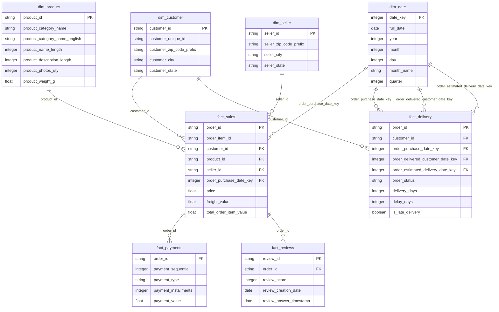

# Final Architecture

> This document summarizes the final implemented technical architecture of the E-Commerce Retail Intelligence Platform.
> For detailed phase-by-phase architecture notes, see `docs/architecture.md`.

---

## 1. Project Overview

The E-Commerce Retail Intelligence Platform is an end-to-end cloud data engineering and analytics engineering project.

The platform takes raw e-commerce data, performs ingestion and validation, builds curated analytical models, detects operational anomalies, exposes business metrics through a secured API, deploys the API to Azure, secures secrets with Azure Key Vault, and monitors availability with Application Insights.

The final system demonstrates:

- Data ingestion
- Data quality validation
- Dimensional warehouse modelling
- dbt transformations and tests
- Operational anomaly detection
- Event-style alert generation
- Azure Blob Storage
- Azure Data Factory orchestration
- Azure SQL Database serving layer
- FastAPI backend
- JWT authentication and RBAC
- Docker containerization
- Azure Container Registry
- Azure App Service deployment
- Azure Key Vault secret management
- Application Insights monitoring

---

## 2. Final End-to-End Architecture

```text
Olist E-Commerce CSV Data
        ↓
Local Python Ingestion
        ↓
Raw SQLite Tables
        ↓
Data Quality Validation
        ↓
Staging Models
        ↓
Dimensional Warehouse
        ↓
dbt Transformations, Tests, and Documentation
        ↓
Operational KPI and Anomaly Detection Layer
        ↓
Power BI Export Layer
        ↓
Azure Blob Storage
        ↓
Azure Data Factory
        ↓
Azure SQL Database
        ↓
FastAPI Backend with JWT Authentication and RBAC
        ↓
Docker Image
        ↓
Azure Container Registry
        ↓
GitHub Actions CI/CD
        ↓
Azure App Service for Containers
        ↓
Azure Key Vault Secret References
        ↓
Application Insights Availability Monitoring
```

---

## 3. Architecture Layers

The final platform is organized into the following technical layers:

| Layer | Main Technologies | Purpose |
|---|---|---|
| Source data layer | Olist CSV files | Provides raw e-commerce data |
| Local ingestion layer | Python, pandas, SQLite | Loads raw CSV files into a local analytical database |
| Data quality layer | Python, SQL | Validates completeness, duplicates, nulls, referential quality, and date consistency |
| Staging layer | SQL, dbt | Cleans and standardizes raw data |
| Warehouse layer | SQL, dimensional modelling | Builds facts, dimensions, and analytical serving views |
| Operational intelligence layer | SQL, Python | Detects anomalies and creates operational alert records |
| API layer | FastAPI, Python | Exposes curated business and operational metrics |
| Security layer | JWT authentication, RBAC, Azure Key Vault | Protects API endpoints and cloud secrets |
| Deployment layer | Docker, ACR, Azure App Service | Deploys the API as a cloud-hosted container |
| Monitoring layer | App Service Logs, Application Insights | Tracks logs, health, and availability |

---

## 4. Source Data Layer

The project uses the Olist Brazilian E-Commerce Public Dataset.

The source data includes core e-commerce entities such as:

- Orders
- Customers
- Sellers
- Products
- Payments
- Reviews
- Geolocation
- Order items
- Product category translations

These CSV files represent the raw operational data source for the project.

---

## 5. Local Ingestion and Raw Layer

The local ingestion layer loads raw CSV files into SQLite.

Purpose:

- Provide a reproducible local development environment
- Preserve raw source structure
- Support SQL-based validation and transformation
- Avoid depending on cloud services during early development

Raw data is loaded into local SQLite tables before being transformed into curated models.

High-level flow:

```text
CSV files
    ↓
Python ingestion scripts
    ↓
Raw SQLite tables
```

---

## 6. Data Quality Layer

The data quality layer validates raw and transformed data before it is used for analytics.

Checks include:

- Row count validation
- Duplicate key checks
- Missing value checks
- Date consistency checks
- Referential checks
- Business rule checks

The goal is to show that the pipeline does not simply load data, but also verifies whether the data is reliable enough for analytics.

---

## 7. Staging Layer

The staging layer standardizes raw source tables into cleaner analytical inputs.

Typical staging responsibilities:

- Rename columns consistently
- Cast dates and numeric fields
- Standardize text values
- Remove unnecessary raw complexity
- Prepare data for warehouse modelling

The staging layer provides a clean boundary between raw data and curated warehouse tables.

---

## 8. Dimensional Warehouse Layer

The warehouse layer uses dimensional modelling to support business analytics.

Core dimensional tables include:

- `dim_date`
- `dim_customer`
- `dim_product`
- `dim_seller`

Core fact tables include:

- `fact_sales`
- `fact_delivery`
- `fact_payments`
- `fact_reviews`

This structure supports analysis across:

- Sales performance
- Customer geography
- Seller performance
- Product category performance
- Delivery performance
- Review and satisfaction patterns
- Payment behavior

Warehouse flow:

```text
Staging tables
    ↓
Dimensions
    ↓
Facts
    ↓
KPI views and serving tables
```

## Database Schema Diagram

The warehouse uses a star-schema style design with fact tables connected to shared dimensions.



## 9. dbt Transformation Layer

dbt is used to organize, test, and document the analytical transformation layer.

The dbt layer demonstrates analytics engineering practices such as:

- Modular SQL models
- Staging models
- Mart models
- Schema tests
- Documentation
- Lineage generation

dbt helps make the transformation logic easier to maintain, test, and explain.

---

## 10. KPI and Business Metrics Layer

The KPI layer creates business-friendly outputs for executive and operational analysis.

Example metric areas:

- Total revenue
- Total orders
- Average order value
- Monthly sales trends
- Top product categories
- Top sellers
- Customer distribution by state
- Review performance
- Delivery performance

These outputs are used by:

- FastAPI endpoints
- Power BI export files
- Business insight summaries

---

## 11. Operational Anomaly Detection Layer

The project includes an operational anomaly detection layer.

This layer identifies unusual or risky operational patterns such as:

- Delivery delays
- High-risk sellers
- High-risk product categories
- Review quality issues
- Operational alert severity patterns
- Category-level or seller-level risk concentration

The anomaly detection design produces structured alert outputs rather than only dashboard metrics.

Important operational tables include:

- `ops_daily_metrics`
- `ops_seller_metrics`
- `ops_category_metrics`
- `ops_anomaly_rules`
- `ops_anomaly_alerts`
- `ops_event_log`
- `ops_event_records`

This gives the project a stronger operational intelligence story.

---

## 12. Power BI Export Layer

The Power BI export layer prepares curated datasets for dashboard development.

This layer is intentionally separated from the main warehouse and API layers.

Purpose:

- Provide dashboard-ready files
- Avoid coupling BI development to raw tables
- Support future Power BI report creation
- Keep dashboard work at the end of the project lifecycle

Power BI dashboard creation is handled in a later phase.

---

## 13. Azure Blob Storage Layer

Azure Blob Storage is used as the cloud raw data landing zone.

Raw Olist CSV files are uploaded to a private blob container.

Cloud storage layout:

```text
ecommerce-retail-data
    ↓
raw/olist/
    ↓
olist CSV files
```

Purpose:

- Store raw source files in Azure
- Demonstrate cloud data lake style storage
- Provide source files for Azure Data Factory
- Separate raw cloud storage from local development files

---

## 14. Azure Data Factory Layer

Azure Data Factory is used for cloud orchestration.

In this project, ADF copies raw order data from Azure Blob Storage into an Azure SQL staging table.

ADF flow:

```text
Azure Blob Storage
    ↓
Azure Data Factory pipeline
    ↓
Azure SQL staging table
```

Implemented ADF objects:

| Object Type | Name |
|---|---|
| Pipeline | `pl_copy_olist_orders_blob_to_sql` |
| Blob linked service | `ls_azure_blob_olist_raw` |
| Azure SQL linked service | `ls_azure_sql_retail` |
| Blob dataset | `ds_blob_olist_orders_raw_csv` |
| SQL dataset | `ds_sql_adf_stg_orders_raw` |
| SQL staging table | `dbo.adf_stg_orders_raw` |

This demonstrates cloud pipeline orchestration using Azure-native services.

---

## 15. Azure SQL Database Layer

Azure SQL Database is the cloud serving database for the deployed platform.

Curated local warehouse outputs are migrated to Azure SQL so that the deployed API can query cloud-hosted data.

Azure SQL stores:

- Dimensional tables
- Fact tables
- Operational metrics
- Anomaly alert tables
- API serving objects
- ADF staging outputs

The deployed FastAPI application connects to Azure SQL when:

```text
APP_ENV=azure
```

Local development can still use SQLite when:

```text
APP_ENV=local
```

This dual-mode design allows the same API codebase to work locally and in Azure.

---

## 16. API Serving Layer

The FastAPI backend exposes curated analytical data through HTTP endpoints.

API endpoint groups include:

- Health endpoints
- Executive KPI endpoints
- Operational alert endpoints
- AI-ready insight endpoints

Example public endpoints:

| Endpoint | Purpose |
|---|---|
| `/` | API landing response |
| `/health/` | API and database health check |
| `/docs` | Swagger documentation |

Example protected endpoints:

| Endpoint | Purpose |
|---|---|
| `/executive/summary` | Executive KPI summary |
| `/executive/monthly-sales` | Monthly sales trend |
| `/operations/alert-summary` | Operational alert summary |
| `/operations/recent-alerts` | Recent operational alerts |
| `/insights/executive-summary` | AI-ready executive insight summary |

---

## 17. API Security and RBAC Layer

The API uses JWT Bearer authentication with role-based access control.

Users authenticate through:

```text
POST /auth/login
```

After successful login, the API returns a signed JWT access token. Protected endpoints require:

```text
Authorization: Bearer <access_token>
```

Authentication endpoints:

| Endpoint | Purpose |
|---|---|
| `/auth/login` | Authenticates a demo user and returns a JWT access token |
| `/auth/me` | Returns the authenticated user's username and role |

Roles:

| Role | Purpose |
|---|---|
| Admin | Full API access |
| Analyst | Business, operational, and insight access |
| Viewer | Limited summary-level read access |

This demonstrates a token-based API security pattern with role-based authorization for portfolio API deployment.

---

## 18. Docker Containerization Layer

The FastAPI backend is packaged as a Docker image.

The Docker image contains:

- FastAPI code
- Python dependencies
- Azure SQL connectivity dependencies
- Microsoft ODBC Driver 18 for SQL Server
- Uvicorn startup command

The Docker image does not contain:

- Local SQLite database
- `.env` secrets
- Virtual environments
- Cache files
- Power BI files

The application runs inside the container on port:

```text
8000
```

---

## 19. Azure Container Registry Layer

Azure Container Registry stores the Docker image used by Azure App Service.

Image reference:

```text
acrecommerceretailmelbin.azurecr.io/ecommerce-retail-api:latest
```

Purpose:

- Store deployable container image
- Separate image storage from source code
- Allow Azure App Service to pull the image securely
- Support GitHub Actions CI/CD deployment

---

## 20. GitHub Actions CI/CD Layer

GitHub Actions automates validation and deployment.

CI/CD responsibilities:

- Validate Python syntax and imports
- Confirm setup checks pass
- Build the Docker image
- Push Docker image tags to Azure Container Registry
- Ensure App Service managed identity exists
- Ensure the App Service identity has `AcrPull` permission
- Configure managed identity based ACR image pull
- Restart Azure App Service
- Verify the deployed `/health/` endpoint

Deployment flow:

```text
Push to main
    ↓
GitHub Actions CI
    ↓
GitHub Actions CD
    ↓
Docker image pushed to ACR
    ↓
Azure App Service updated
    ↓
/health/ endpoint verification
```

---

## 21. Azure App Service Deployment Layer

Azure App Service hosts the FastAPI backend as a Linux container.

The deployed API runs at:

```text
https://app-ecommerce-retail-api-melbin-a9habdejcgf0fkha.francecentral-01.azurewebsites.net
```

App Service configuration:

| Setting | Value |
|---|---|
| Publish mode | Container |
| Operating system | Linux |
| Container registry | Azure Container Registry |
| Image | `ecommerce-retail-api:latest` |
| Runtime port | `8000` |
| Runtime database mode | `APP_ENV=azure` |

The Web App uses managed identity to pull the container image from ACR with the `AcrPull` role.

---

## 22. Azure Key Vault Security Layer

Azure Key Vault stores sensitive values used by the deployed API.

Secrets stored in Key Vault include:

- Azure SQL server
- Azure SQL database
- Azure SQL username
- Azure SQL password
- JWT signing secret
- JWT admin username and password
- JWT analyst username and password
- JWT viewer username and password

App Service uses Key Vault references in environment variables.

JWT Key Vault mapping:

| Key Vault Secret | App Service Setting | Purpose |
|---|---|---|
| `jwt-secret-key` | `JWT_SECRET_KEY` | Signs JWT access tokens |
| `jwt-admin-username` | `JWT_ADMIN_USERNAME` | Demo admin username |
| `jwt-admin-password` | `JWT_ADMIN_PASSWORD` | Demo admin password |
| `jwt-analyst-username` | `JWT_ANALYST_USERNAME` | Demo analyst username |
| `jwt-analyst-password` | `JWT_ANALYST_PASSWORD` | Demo analyst password |
| `jwt-viewer-username` | `JWT_VIEWER_USERNAME` | Demo viewer username |
| `jwt-viewer-password` | `JWT_VIEWER_PASSWORD` | Demo viewer password |

Non-sensitive JWT settings can remain as plain App Service settings:

| App Service Setting | Value |
|---|---|
| `JWT_ALGORITHM` | `HS256` |
| `JWT_ACCESS_TOKEN_EXPIRE_MINUTES` | `60` |

Example pattern:

```text
@Microsoft.KeyVault(VaultName=kvretailmelbin;SecretName=azure-sql-password)
```

Security flow:

```text
Azure Key Vault
    ↓
App Service Key Vault references
    ↓
Resolved environment variables
    ↓
FastAPI application
```

The FastAPI application does not directly call Key Vault. Azure App Service resolves the references at runtime.

---

## 23. Monitoring and Availability Layer

Azure monitoring is used to validate that the deployed API is reachable and observable.

Implemented monitoring features:

- App Service application logging
- Log Stream
- Application Insights
- Standard availability test
- Automatic availability alert rule

Availability test:

| Field | Value |
|---|---|
| Test name | `fastapi-health-check` |
| Endpoint | `/health/` |
| Expected status | HTTP 200 |
| Frequency | 5 minutes |
| Alert condition | Failed locations >= 2 |

Application Insights availability testing is used as the primary monitoring approach for this portfolio deployment.

The public `/health/` endpoint remains unauthenticated so monitoring and CI/CD smoke tests can verify API availability without storing privileged credentials in monitoring tools.

---

## 24. Verification and Testing Layer

The project includes multiple verification scripts to prove that each major layer works.

Verification coverage includes:

- Data ingestion
- Data quality
- Warehouse outputs
- API functionality
- RBAC behavior
- Docker setup
- Azure Blob setup
- Azure SQL setup
- Azure Data Factory setup
- Azure App deployment
- Azure Key Vault setup
- Azure monitoring setup

Important verification scripts include:

| Script | Purpose |
|---|---|
| `scripts/run_tests.py` | Runs automated unit, API, and integration tests |
| `scripts/verify_azure_blob_setup.py` | Verifies Azure Blob Storage setup |
| `scripts/verify_azure_sql_setup.py` | Verifies Azure SQL setup |
| `scripts/verify_adf_setup.py` | Verifies Azure Data Factory setup documentation/files |
| `scripts/verify_adf_pipeline_output.py` | Verifies ADF pipeline output in Azure SQL |
| `scripts/verify_azure_app_deployment.py` | Verifies deployed API endpoints |
| `scripts/verify_key_vault_setup.py` | Verifies API still works after Key Vault integration |
| `scripts/verify_azure_monitoring_setup.py` | Verifies monitoring setup evidence and endpoint availability |

This makes the project easier to validate and explain.

---

## 25. Final Cloud Architecture

```text
Raw Olist CSV Data
        ↓
Azure Blob Storage
        ↓
Azure Data Factory
        ↓
Azure SQL Database
        ↑
Azure Key Vault
        ↓
Azure App Service FastAPI API
        ↓
Application Insights Availability Monitoring
        ↓
Azure Monitor Alert Rule
```

This cloud architecture demonstrates:

- Cloud raw data storage
- Cloud orchestration
- Cloud relational serving layer
- Secured containerized API deployment
- Secret management
- Availability monitoring

---

## 26. Local Development Architecture

```text
Raw Olist CSV Data
        ↓
Python ingestion scripts
        ↓
SQLite database
        ↓
dbt transformations and tests
        ↓
Operational anomaly detection
        ↓
FastAPI local API
        ↓
Automated tests
```

This local architecture allows development, testing, and transformation work to happen without requiring every Azure service to be active.

---

## 27. Final System Design Decisions

Important design decisions:

| Decision | Reason |
|---|---|
| SQLite for local development | Simple, reproducible, low cost |
| Azure SQL for cloud serving | Enables deployed API to query cloud-hosted relational data |
| Azure Blob for raw files | Demonstrates cloud data lake style storage |
| Azure Data Factory for orchestration | Demonstrates Azure-native data movement |
| FastAPI for serving | Lightweight and suitable for analytical API endpoints |
| Docker for deployment | Makes the API portable and cloud deployable |
| Azure App Service for hosting | Managed container hosting without Kubernetes complexity |
| Key Vault for secrets | Avoids storing SQL credentials, JWT signing secret, and demo user credentials directly in App Service settings |
| JWT authentication | Demonstrates token-based API authentication with role-based authorization |
| GitHub Actions CI/CD | Automates validation, container build, ACR push, App Service deployment, and health verification |
| Application Insights for monitoring | Provides availability checks and alerting |
| Power BI deferred | Keeps dashboarding as a final presentation layer |

---

## 28. Skills Demonstrated

This architecture demonstrates practical skills in:

- Python data engineering
- SQL transformation
- dbt analytics engineering
- Dimensional modelling
- Data quality validation
- Operational analytics
- Anomaly detection logic
- API development
- JWT authentication and RBAC
- Automated testing
- Docker containerization
- GitHub Actions CI/CD
- Azure Blob Storage
- Azure SQL Database
- Azure Data Factory
- Azure App Service
- Azure Container Registry
- Azure Key Vault
- Azure Monitor and Application Insights
- Technical documentation

---

## 30. Final Architecture Outcome

The final implemented architecture proves that the project is more than a local analytics notebook.

It is a complete cloud data platform with:

- Reproducible local development
- Tested data transformations
- Cloud storage and orchestration
- Cloud relational serving
- JWT-secured API deployment
- Secret management
- GitHub Actions CI/CD
- Availability monitoring
- Clear verification evidence

This makes the project suitable for demonstrating entry-level cloud data engineering and analytics engineering skills.