# Project Showcase: E-Commerce Retail Intelligence Platform

## Project Title

**E-Commerce Retail Intelligence Platform with Operational Anomaly Detection and AI-Ready Business Insights**

---

## 1. Project Overview

This project is an end-to-end cloud data engineering and analytics engineering portfolio project built using Python, SQL, dbt, FastAPI, Docker, GitHub Actions, and Microsoft Azure.

The platform ingests raw e-commerce data, validates data quality, builds analytical warehouse models, detects operational anomalies, exposes secured business insights through FastAPI endpoints, deploys the API as a Docker container on Azure App Service, secures secrets with Azure Key Vault, monitors availability with Application Insights, and automates deployment using GitHub Actions CI/CD.

---

## 2. Business Problem

E-commerce businesses need reliable visibility into sales performance, customer activity, seller behaviour, delivery performance, payment patterns, and operational risk.

This project simulates a retail analytics platform that helps answer questions such as:

```text
How much revenue is the platform generating?
Which products and sellers perform best?
Where are customers located?
Are there delivery or operational anomalies?
Which sellers or categories require attention?
Can business users access summary insights through an API?
Is the cloud-deployed API secure, monitored, and automatically deployable?
```

---

## 3. Dataset

The project uses the Olist Brazilian E-Commerce Public Dataset.

The dataset includes anonymised e-commerce data covering:

```text
Orders
Customers
Products
Sellers
Payments
Reviews
Delivery timestamps
Geolocation data
Product category translations
```

---

## 4. Technology Stack

| Area | Tools |
|---|---|
| Programming | Python |
| Data transformation | SQL, dbt |
| Local database | SQLite |
| Cloud storage | Azure Blob Storage |
| Cloud warehouse / serving database | Azure SQL Database |
| Cloud orchestration | Azure Data Factory |
| API layer | FastAPI |
| Security | JWT authentication, RBAC, Azure Key Vault |
| Containerisation | Docker |
| Container registry | Azure Container Registry |
| Cloud deployment | Azure App Service |
| CI/CD | GitHub Actions |
| Monitoring | Azure Application Insights, Azure Monitor |
| Documentation | Markdown, architecture diagrams, screenshots |

---

## 5. Final Architecture Summary

```text
Raw Olist CSV files
        ↓
Local Python ingestion
        ↓
Raw SQLite tables
        ↓
Data quality validation
        ↓
Staging layer
        ↓
Dimensional warehouse layer
        ↓
KPI and operational analytics views
        ↓
Operational anomaly detection
        ↓
AI-ready business insight outputs
        ↓
Azure Blob Storage
        ↓
Azure Data Factory copy pipeline
        ↓
Azure SQL Database
        ↓
FastAPI analytics API
        ↓
Docker container
        ↓
Azure Container Registry
        ↓
Azure App Service
        ↓
GitHub Actions CI/CD
        ↓
Application Insights monitoring
```

---

## 6. Repository and Project README

The GitHub repository contains the full project structure, documentation, workflow badges, setup instructions, and technical evidence.

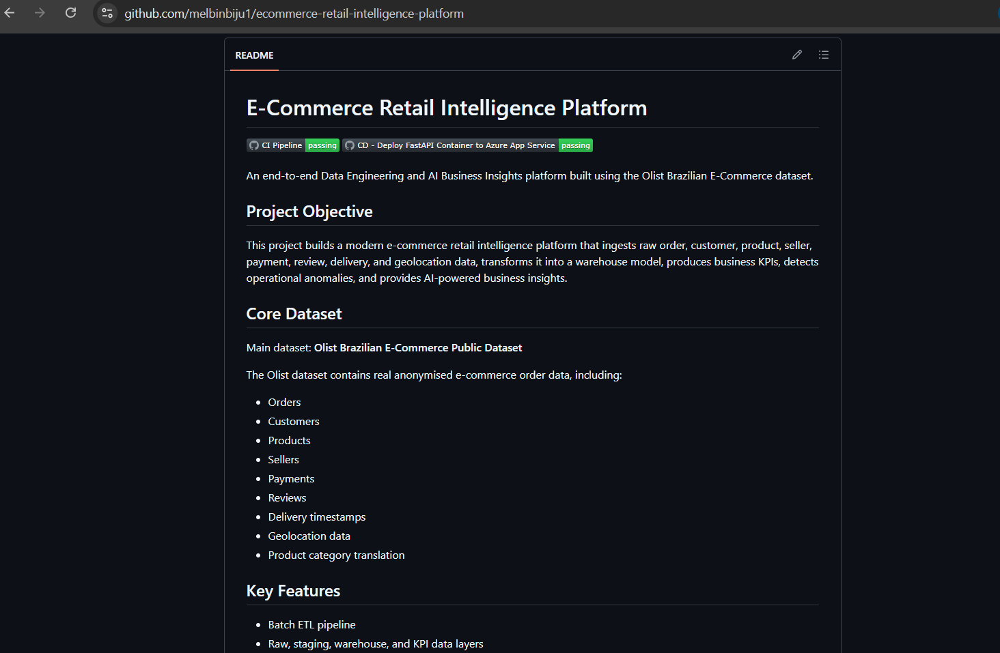

This screenshot shows:

```text
Project README
CI status badge
CD status badge
Project objective
Dataset summary
Feature overview
```

---

## 7. Continuous Integration

The project includes a GitHub Actions CI workflow that validates the repository before deployment.


The CI pipeline checks:

```text
Repository checkout
Large SQLite database is not tracked
Python setup
Dependency installation
Python syntax validation
Core import validation
Docker setup verification
CI setup verification
Docker image build
```

This proves the project can be validated and containerised in a clean GitHub Actions environment.

---

## 8. Continuous Deployment

The project includes a GitHub Actions CD workflow that deploys the FastAPI Docker container to Azure App Service.


The CD workflow performs:

```text
Azure login using service principal
Docker login to Azure Container Registry
Docker image build
Docker image push to ACR
App Service managed identity validation
AcrPull permission validation
Managed identity based ACR pull configuration
App Service container image update
App Service restart
Deployed /health/ endpoint verification
```

This turns the project from a manually deployed API into a repeatable CI/CD-enabled cloud deployment.

---

## FastAPI Swagger Documentation

The project exposes analytics, operational risk, and AI-ready insight outputs through a documented FastAPI backend.

The Swagger UI shows the API structure, authentication routes, public health endpoints, and JWT-protected business endpoints.

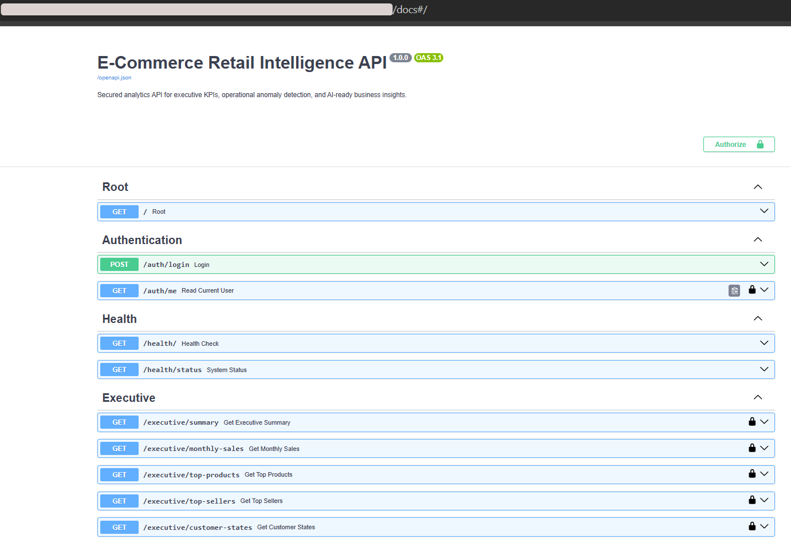

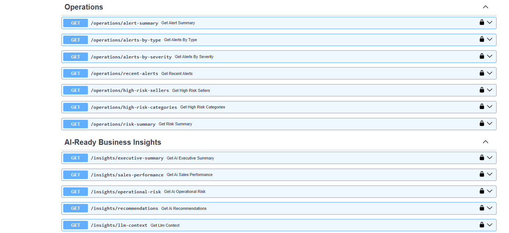

The API includes endpoint groups for:

```text
Root endpoint
JWT authentication
Health checks
Executive KPIs
Operational anomaly alerts
Risk summaries
AI-ready business insights
```

The lock icons indicate endpoints protected by JWT Bearer authentication.

---

## 10. JWT Authentication Evidence

The API includes JWT Bearer authentication with role-based access control.

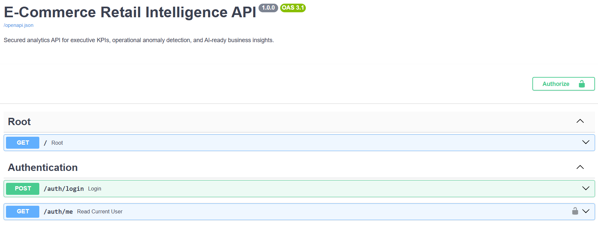

Users authenticate through:

```text
POST /auth/login
```

The login endpoint returns a signed JWT access token. Protected endpoints are accessed with:

```text
Authorization: Bearer <access_token>
```

The API supports three roles:

```text
admin
analyst
viewer
```

JWT secrets and demo user credentials are stored in Azure Key Vault for the deployed Azure App Service.

---

## 11. Health Endpoint

The health endpoint confirms that the deployed API is running and connected to the serving database.

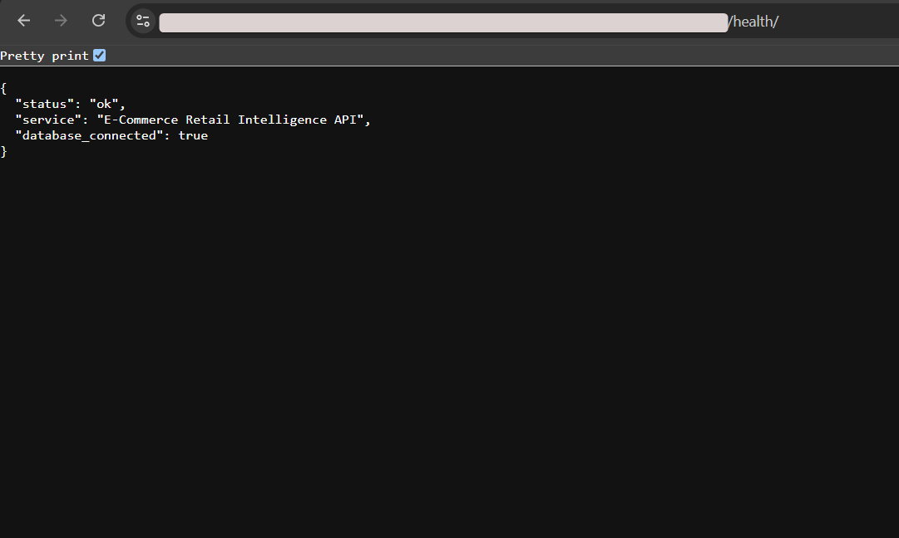

Expected response:

```json
{
  "status": "ok",
  "service": "E-Commerce Retail Intelligence API",
  "database_connected": true
}
```

This endpoint is also used by the CD pipeline as a deployment smoke test.

---

## 12. Executive KPI API Response

The executive summary endpoint provides high-level business performance metrics.

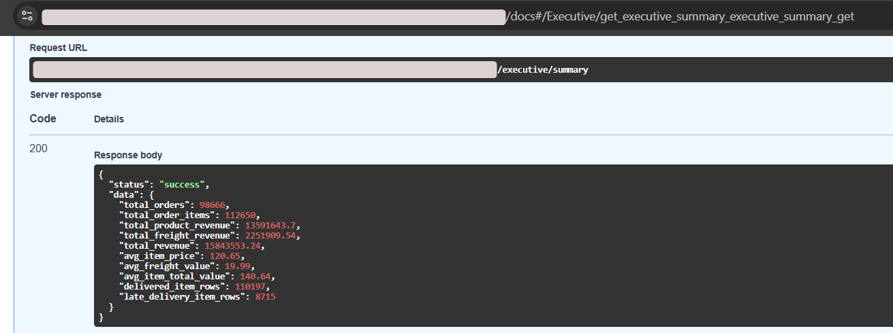

The response includes:

```text
Total orders
Total order items
Product revenue
Freight revenue
Total revenue
Average item price
Average freight value
Average item total value
Delivered item rows
Late delivery item rows
```

This demonstrates that curated warehouse outputs are accessible through the API.

---

## 13. Operational Anomaly API Response

The operational alert summary endpoint exposes anomaly detection results.

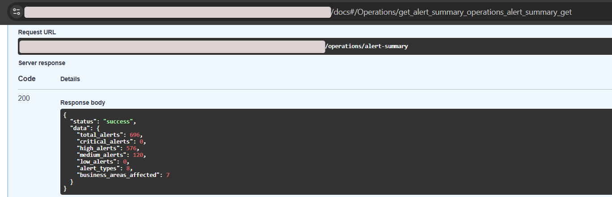

The response includes:

```text
Total operational alerts
Critical alerts
High alerts
Medium alerts
Low alerts
Alert types
Business areas affected
```

This demonstrates the operational intelligence layer of the project.

---

## 14. AI-Ready Business Insights API Response

The AI-ready insights endpoint converts analytical outputs into structured business insight text.

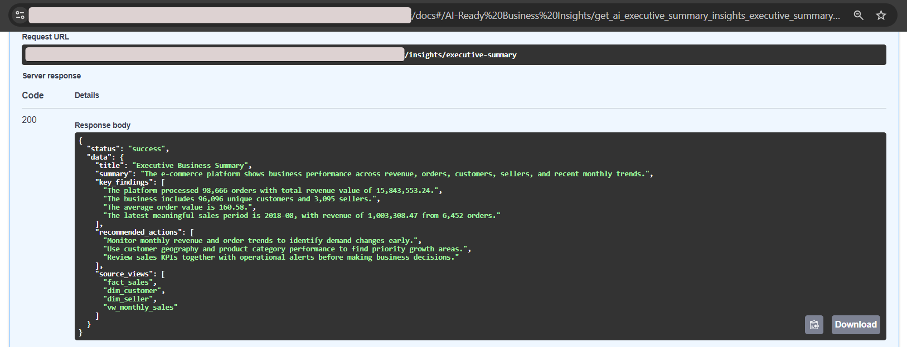

The response includes:

```text
Business summary
Key findings
Recommended actions
Source views used for insight generation
```

This demonstrates how the analytics layer can support AI-assisted business reporting without exposing raw database complexity to end users.

---

## 15. Azure App Service Deployment

The FastAPI application is deployed to Azure App Service as a Linux container.

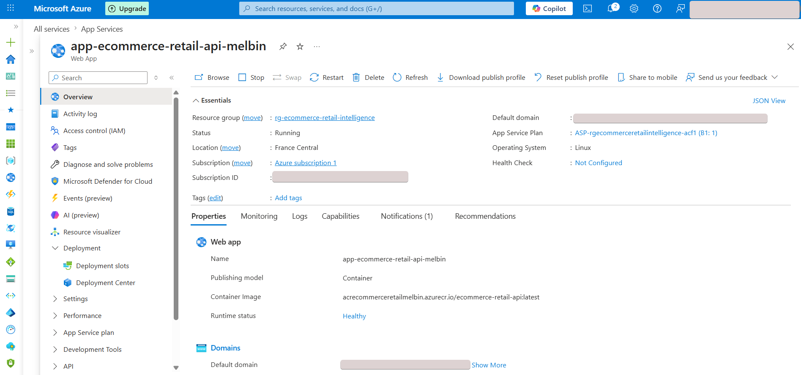

This screenshot shows:

```text
App Service running status
Linux container runtime
Container image from Azure Container Registry
Healthy runtime status
Azure resource group
App Service plan
```

This demonstrates cloud deployment of the API layer.

---

## 16. Azure Container Registry

The Docker image is stored in Azure Container Registry.

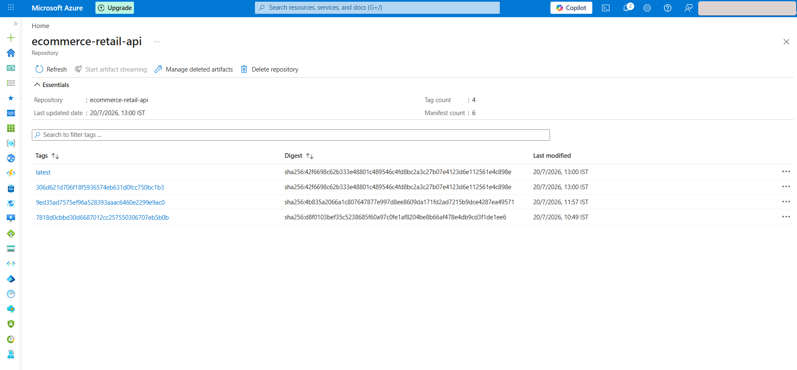

This screenshot shows:

```text
Container repository
latest image tag
Commit-specific image tags
Image digests
Last modified timestamps
```

The CD pipeline pushes both `latest` and commit-SHA tags for deployment traceability.

---

## 17. Azure SQL Database

Curated warehouse tables and API serving objects are stored in Azure SQL Database.

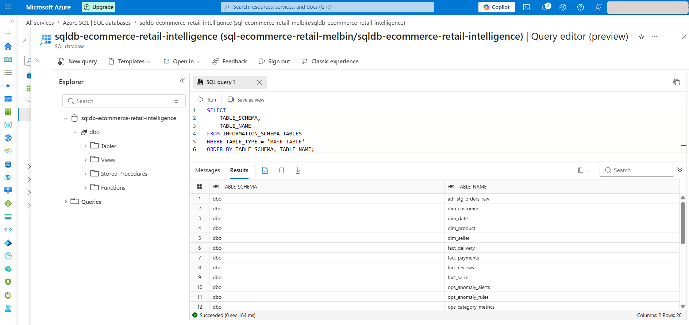

The Azure SQL layer includes:

```text
Dimensional tables
Fact tables
Operational metrics tables
Anomaly detection tables
API serving objects
ADF staging table
```

This demonstrates that the local analytical outputs were migrated into a cloud serving database.

---

## 18. Azure Blob Storage

Raw source CSV files are stored in Azure Blob Storage.

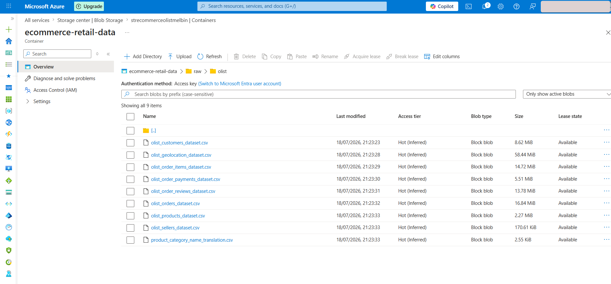

The Blob container stores the raw Olist files under:

```text
raw/olist/
```

This demonstrates a cloud landing zone for raw input data.

---

## 19. Azure Data Factory Pipeline

Azure Data Factory is used to orchestrate a cloud copy pipeline from Blob Storage into Azure SQL staging.

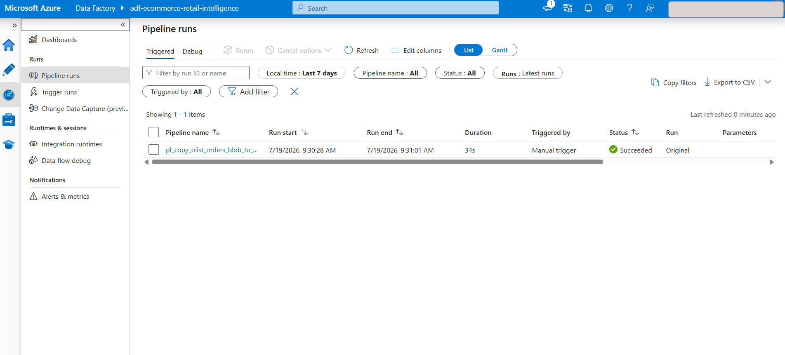

This screenshot shows:

```text
ADF pipeline run
Manual trigger
Successful status
Pipeline duration
Blob-to-SQL copy workflow
```

This demonstrates cloud orchestration capability.

---

## 20. Azure Key Vault

Azure Key Vault stores application secrets separately from source code and App Service configuration.

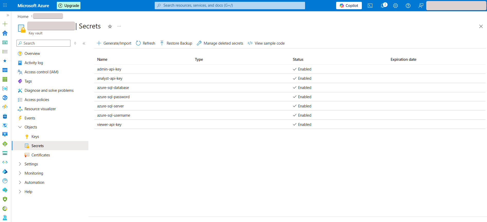

Stored secret names include:

```text
Azure SQL server
Azure SQL database
Azure SQL username
Azure SQL password
JWT signing secret
JWT admin username
JWT admin password
JWT analyst username
JWT analyst password
JWT viewer username
JWT viewer password
```

Only secret names are shown. Secret values are not exposed.

---

## 21. Application Insights Availability Monitoring

Application Insights monitors the deployed API health endpoint.

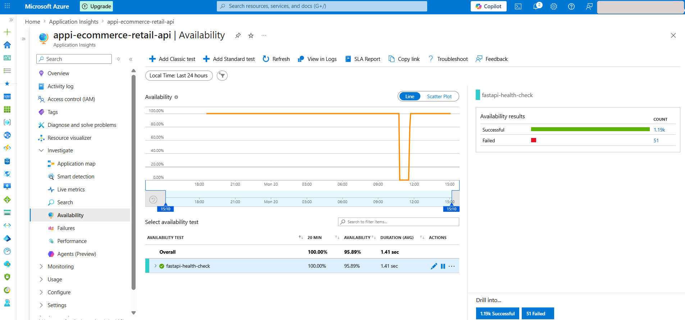

The availability test checks:

```text
Public API health endpoint
HTTP availability
Average response duration
Successful and failed checks
Availability trend
```

This demonstrates cloud monitoring for the deployed API.

---

## 22. Azure Monitor Alert Rule

Azure Monitor includes an alert rule connected to the Application Insights availability test.

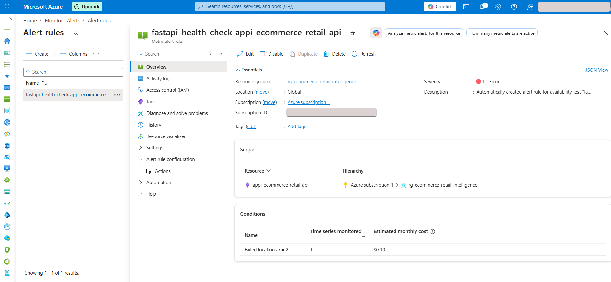

The alert rule monitors:

```text
Availability test failures
Failed locations threshold
Severity level
Application Insights resource scope
```

This demonstrates alerting for API availability risk.

---

## 23. Security Design

The project includes multiple security layers.

| Layer | Security Design |
|---|---|
| API | JWT Bearer authentication |
| API access | Role-based access control |
| Cloud secrets | Azure Key Vault |
| App runtime secrets | Key Vault references in App Service |
| Container image pull | App Service managed identity with AcrPull |
| CI/CD secrets | GitHub repository secrets |
| Source control | `.env` and local database excluded from Git |

---

## 24. Testing and Verification

The project includes automated tests and verification scripts.

Testing coverage includes:

```text
Unit tests
API tests
RBAC tests
Integration checks
Pipeline output checks
Docker setup verification
CI setup verification
Azure Blob verification
Azure SQL verification
Azure App deployment verification
Key Vault verification
Azure Monitoring verification
```

The CI workflow validates that the project builds successfully in GitHub Actions.

---

## 25. Project Outcome

The final platform demonstrates:

```text
End-to-end data engineering workflow
Data quality validation
Warehouse modelling
KPI creation
Operational anomaly detection
FastAPI analytics serving
API authentication and RBAC
Docker containerisation
Azure Blob Storage integration
Azure SQL Database migration
Azure Data Factory orchestration
Azure App Service deployment
Azure Key Vault secret management
Application Insights monitoring
GitHub Actions CI/CD
Professional documentation and screenshots
```

---

## 26. Skills Demonstrated

| Skill Area | Evidence |
|---|---|
| Data engineering | Ingestion, validation, staging, warehouse modelling |
| Analytics engineering | dbt models, KPI views, dimensional modelling |
| SQL | Transformations, analytical models, serving objects |
| Python | ETL scripts, validation scripts, API backend |
| Cloud engineering | Azure Blob, Azure SQL, ADF, App Service, Key Vault, Monitor |
| API development | FastAPI endpoints, Swagger docs |
| Security | JWT authentication, RBAC, Key Vault, managed identity |
| DevOps | Docker, ACR, GitHub Actions CI/CD |
| Monitoring | Application Insights availability test and alert rule |
| Documentation | README, architecture docs, governance docs, project showcase |

---

## 29. Repository

```text
https://github.com/melbinbiju1/ecommerce-retail-intelligence-platform
```